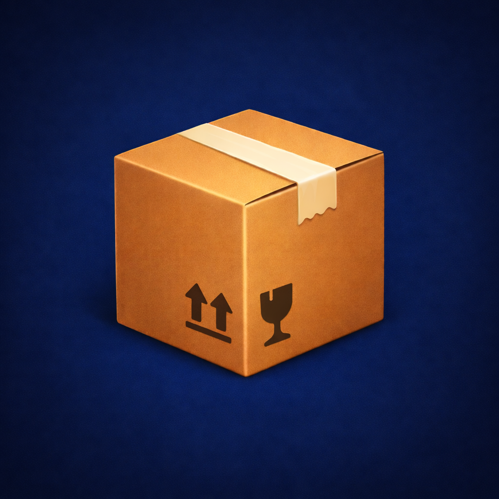

<p align="center">
  
</p>

# Flyttekasse styring

En lille web-app til at holde styr på flyttekasser, rum og indhold under en flytning.
Appen giver en enkel og overskuelig måde at registrere, hvad der ligger i hvilke kasser – både pr. rum og på tværs af hele projektet.

Appen er lavet til at køre “server-only” på et simpelt lokalt webmiljø, så data kan gemmes stabilt i en `data.json` ved siden af appen.

---

## Funktioner

- Opret **Rum**
- Opret **Flyttekasser** med automatisk nummerering
- Opret **Indhold / varer** med antal og enhed (stk., kg., sæt, pk.)
- Tilføj noter til både kasser og varer
- **Søg** efter varer og se præcis hvilken kasse og hvilket rum de ligger i
- Vis oversigt:
  - pr. rum
  - pr. flyttekasse
  - samlet for hele projektet
- Hurtig navigation mellem kasser og indhold
- Automatisk gemning af ændringer

---

## Screenshots

Nedenfor ses eksempler på brugen af appen.

### Opret flyttekasse


### Indhold i flyttekasse


### Print / PDF


> Tip: App'en kan også bruges på tablets og telefoner.

---

## Nye og udvidede features

- **Understøtter flere enheder samtidig**
  Appen kan bruges fra flere enheder på samme tid (fx telefon, tablet og computer), uden at man forstyrrer hinandens arbejde.

- **Live synkronisering**
  Ændringer lavet på én enhed bliver automatisk opdateret på de andre, uden at afbryde igangværende indtastning.

- **Server-side håndtering af flyttekasser**
  - Flyttekasser oprettes server-side for at sikre, at kassenumre altid er unikke – også når flere enheder bruges samtidigt.
  - Flyttekasser slettes server-side, så kassenumre kan genbruges, hvis en kasse fjernes.

- **Konfliktsikring**
  - Appen opdager, hvis data er blevet ændret fra en anden enhed
  - Lister og oversigter opdateres automatisk uden at nulstille formularer

---

## Struktur

```
flyttekasse/
  index.html
  data.json
  load.php
  save.php
  storage.php
  create_box.php
  reserve_box.php
  delete_box.php
  README.md
```

---

## Kom i gang

### Krav
- En webserver med **PHP**
- Ingen database er nødvendig

### Kørsel med MAMP
1. Kopiér projektmappen til `htdocs`
2. Start MAMP
3. Åbn i browseren:
   http://localhost/flyttekasse/

### Kørsel med LAMP
Appen fungerer også uden problemer på et klassisk **LAMP-setup** (Linux, Apache, PHP).
Ingen database er nødvendig.

### Andre setups
Appen kan også køres via:
- XAMPP
- Docker (Apache + PHP)
- Andre lokale eller interne webservere, der kan afvikle HTML og PHP

Det vigtigste er, at PHP har skriveadgang til `data.json`.

---

God flytning 📦🚚