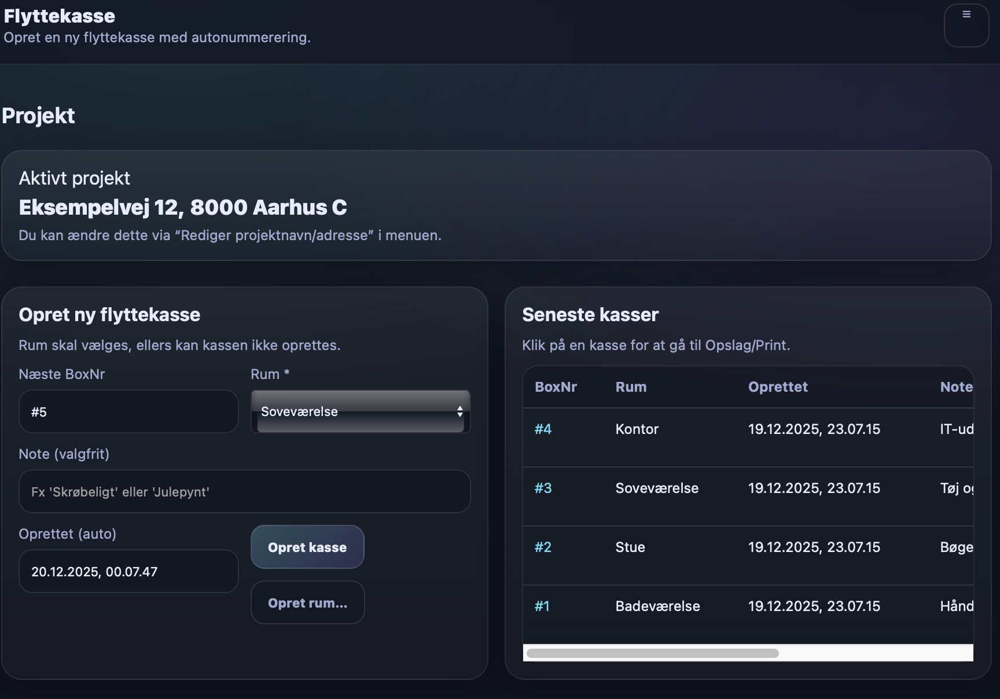
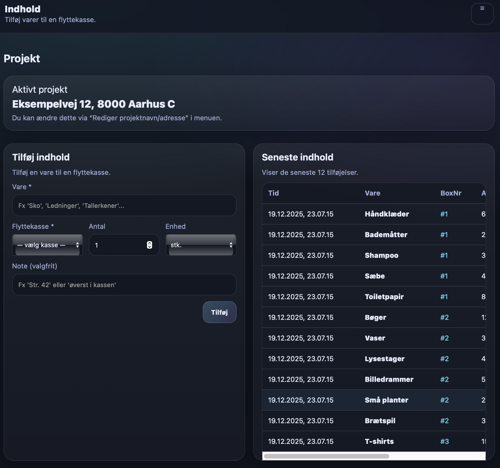
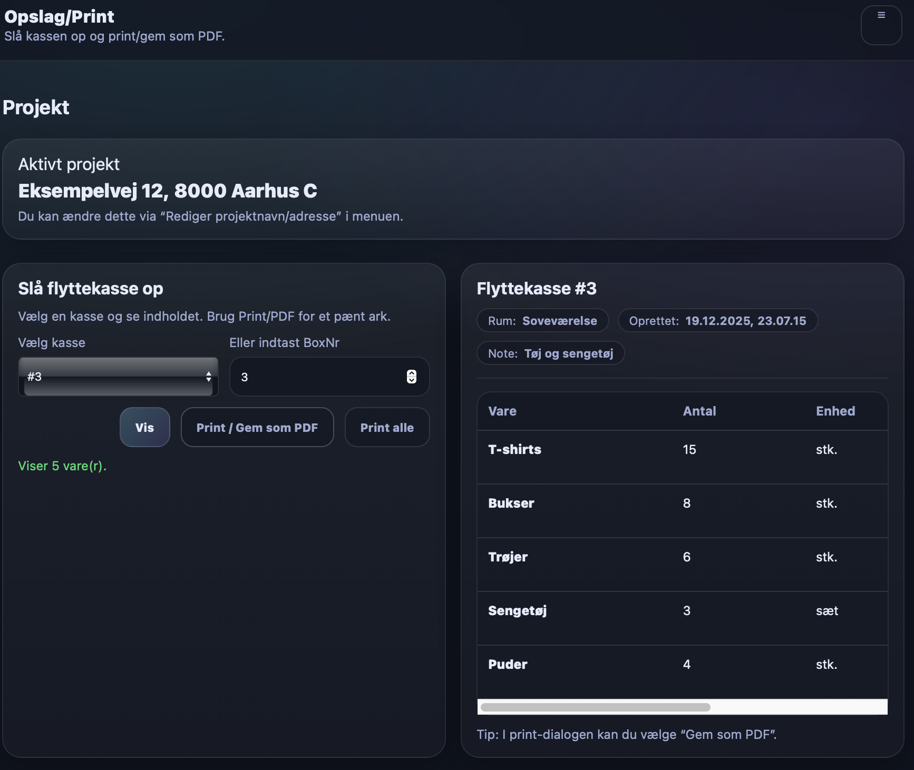

# Flyttekasse styring

En lille web-app til at holde styr på flyttekasser, rum og indhold – med søgning og en print-/PDF-venlig oversigt pr. flyttekasse eller samlet for hele projektet.

Appen er lavet til at køre “server-only” på et simpelt lokalt webserver-setup (fx MAMP), så data kan gemmes stabilt i en `data.json` ved siden af appen.

## Funktioner

- Opret **Rum**
- Opret **Flyttekasser** (autonummerering) med rum, dato og note
- Opret **Indhold** (varer) med antal + enhed (stk., kg., sæt, pk.) og note
- **Søg** efter varer og se hvilke kasser de ligger i
- **Slå kasse op** og se indhold i en liste
- **Rediger/Slet** rum, flyttekasser og varer
- **Print / Gem som PDF** med pæn opsætning
- **Projekt**: indtast projektnavn/adresse (vises i toppen og på print)

## Screenshots

Nedenfor ses eksempler på brugen af appen.

### Opret flyttekasse


### Indhold i flyttekasse


### Print / PDF



> Tip: App'en kan også bruges på tablets og telefoner.

## Struktur

```
flyttekasse/
  index.html
  data.json
  load.php
  save.php
  README.md
```

- `data.json` er den eneste datafil.
- `load.php` læser `data.json`
- `save.php` overskriver `data.json` ved ændringer (autosave)

## Kom i gang med MAMP (macOS)

1. Installer og start **MAMP** (kun Apache er nødvendig)
2. Kopiér mappen `flyttekasse` til:

   `/Applications/MAMP/htdocs/`

3. Åbn i browser:

   `http://localhost:8888/flyttekasse/`

### Test af endpoints

- `http://localhost:8888/flyttekasse/load.php`
- `http://localhost:8888/flyttekasse/data.json`

## Åbn på iPhone/iPad på samme netværk

1. Find din Macs lokale IP-adresse (fx `192.168.1.23`)
2. Sørg for at MAMP/Apache kører
3. Åbn på mobilen:

   `http://<DIN_IP>:8888/flyttekasse/`

> Tip: macOS firewall kan blokere. Tillad indgående forbindelser til Apache/MAMP hvis nødvendigt.

## Print / PDF

På siden “Opslag/Print” kan du vælge en kasse og trykke **Print**.
I browserens print-dialog kan du vælge **Gem som PDF**.

## Dataformat

`data.json` indeholder:

- `projectName` (string)
- `rooms[]` (id + name)
- `boxes[]` (id + boxNr + roomId + createdAt + note)
- `items[]` (id + boxNr + name + qty + unit + note + createdAt)

## Licens

Dette projekt er licenseret under MIT License.

Se filen `LICENSE` for fulde licensbetingelser.

Du er velkommen til at bruge, modificere og distribuere projektet frit, så længe licensteksten bevares.
